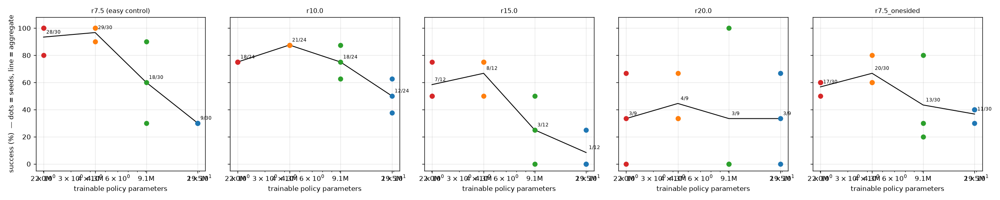
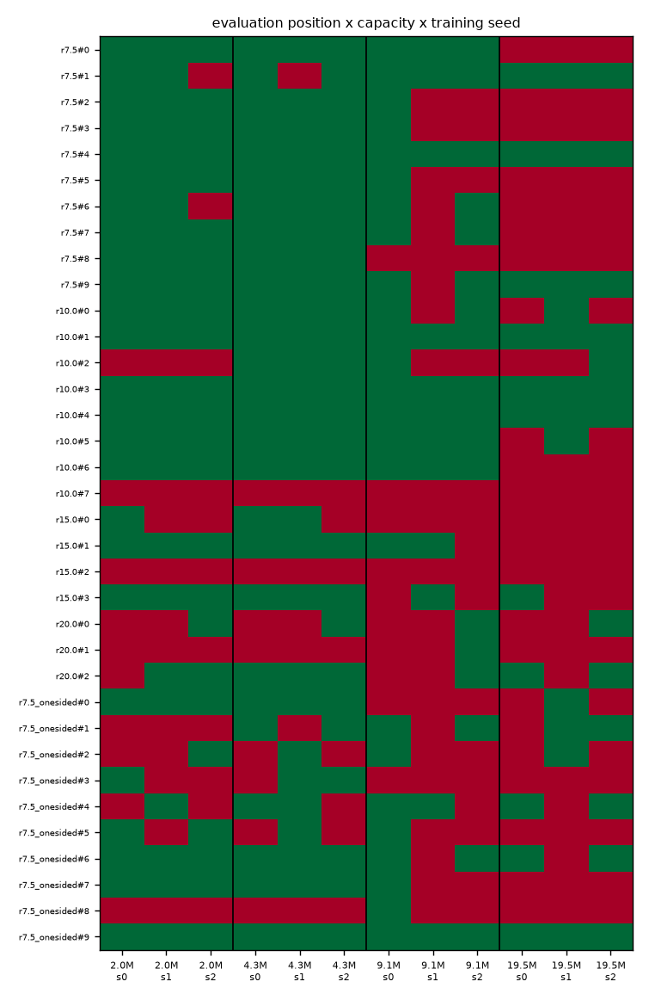
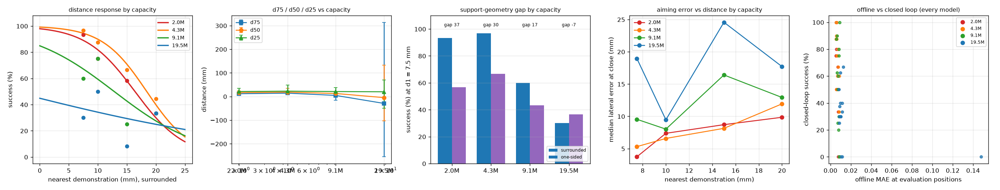
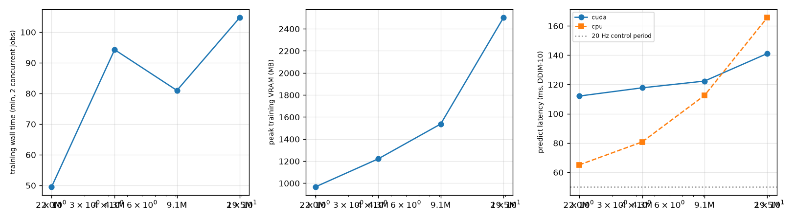

# Capacity × density scaling — completed artifacts, qualified scientific result

## 1. Research question

Does additional TinyRDT policy capacity expand spatial generalization under controlled demonstration density and support geometry?

**Audit status:** all 45 scheduled new models have final checkpoints and evaluations. However, a post-training source audit found that interrupted training did not restore EMA state. Sixteen final run configurations record a resume. Consequently, the complete matrix below is descriptive evidence, not a validated causal estimate of capacity. No new training was launched during this audit.

## 2–4. Prior evidence, pre-registration, frozen baseline

The scientific baseline is commit `2c86475` (PR #9). Its controlled-density experiment established decreasing success with increasing nearest-demo distance and a large surrounded/one-sided gap at 7.5 mm. The capacity pre-registration was committed in `0186876`; its hypotheses have not been edited. See [specification](docs/research/capacity_density_scaling_spec.md), [freeze](docs/research/density_sweep_freeze.json), and [deviations](docs/research/capacity_density_scaling_deviation.md).

The original baseline d50 was 16.0 mm [11.9, 21.8], fitted over all six surrounded conditions. Comparisons in this study use only the four shared surrounded conditions, giving a different descriptive baseline estimate of 16.4 mm. This does not revise the historical result.

## 5–6. Architecture and exact parameter counts

| label | hidden / blocks / heads | trainable | frozen | total |
|---|---|---:|---:|---:|
| 2M | 192 / 4 / 6 | 2,009,670 | 927,008 | 2,936,678 |
| nominal 5M (4.3M) | 256 / 5 / 8 | 4,304,902 | 927,008 | 5,231,910 |
| nominal 10M (9.1M) | 320 / 7 / 10 | 9,137,286 | 927,008 | 10,064,294 |
| nominal 20M (19.5M) | 416 / 9 / 13 | 19,517,062 | 927,008 | 20,444,070 |

Counts were obtained by instantiating TinyRDT. The family uses head dimension 32, MLP width 4d, and depth round(d/48). The frozen pooled MobileNet, input image resolution, token semantics, positional embeddings, proprioception, x0 objective, H=16 and action output representation are retained.

## 7–10. Datasets, conditions, seeds and exposure

The exact five existing density datasets were reused: r10, r15, r20, r7.5 one-sided and r7.5 surrounded. Each condition has three training seeds (0, 1, 2). No demonstrations were regenerated. The selected benchmark has 8, 4, 3, 10 and 10 evaluation positions respectively.

Training uses 80,222 optimizer steps with batch 8, AdamW lr 0.001, weight decay 0.0001, clipping 1.0 and EMA decay 0.999. This is matched data exposure across capacities within a condition, **not matched FLOPs**. The pre-registration incorrectly describes every dataset as having 4,339 windows: actual condition-specific window counts and passes are recorded in `docs/research/capacity_integrity_audit.json`. The common step budget was not derived separately for each condition. This small exposure deviation must accompany interpretation.

Measured windows / effective passes: r10 4,331 / 148.182; r15 4,336 / 148.011; r20 4,345 / 147.704; one-sided 4,316 / 148.697; surrounded control 4,323 / 148.456. These differ from the approximately 147.87 target.

## 11–14. Compute, training diagnostics, offline metrics and training scenes

Runs used CUDA fp32, initially two training workers, later one at the user's request, then two again. Multiple WSL interruptions and overlapping launchers affected timing and some runs. Reported wall times cannot be treated as a fair capacity benchmark because resumed timers reset and concurrency changed. VRAM below is allocated GPU memory, not system RAM.

| capacity | mean train MAE | mean held-out MAE | training-scene successes / 150 |
|---|---:|---:|---:|
| 2M | 0.00477 | 0.00644 | 139/150 |
| 4.3M | 0.00532 | 0.00664 | 144/150 |
| 9.1M | 0.00682 | 0.00788 | 120/150 |
| 19.5M | 0.01950 | 0.01928 | 66/150 |

These are descriptive means over conditions and seeds. No separate validation set was introduced into the density study; held-out evaluation-position errors must not be relabeled validation errors. Per-joint and start metrics remain in each existing offline JSON file. Training-scene failures were retained. The integrity manifest inventories original logs and loss records.

## 15–16. Raw closed-loop results and capacity scaling

Each entry gives successes for seeds 0/1/2, aggregate count and rate. All use K=8, DDIM-10, policy seed 0, 150 steps and the existing physics-v2 criteria.

| capacity | r10 | r15 | r20 | r7.5 one-sided | r7.5 surrounded |
|---|---|---|---|---|---|
| 2M | 6,6,6; 18/24 (75.0%) | 3,2,2; 7/12 (58.3%) | 0,1,2; 3/9 (33.3%) | 6,5,6; 17/30 (56.7%) | 10,10,8; 28/30 (93.3%) |
| 4.3M | 7,7,7; 21/24 (87.5%) | 3,3,2; 8/12 (66.7%) | 1,1,2; 4/9 (44.4%) | 6,8,6; 20/30 (66.7%) | 10,9,10; 29/30 (96.7%) |
| 9.1M | 7,5,6; 18/24 (75.0%) | 1,2,0; 3/12 (25.0%) | 0,0,3; 3/9 (33.3%) | 8,2,3; 13/30 (43.3%) | 9,3,6; 18/30 (60.0%) |
| 19.5M | 3,5,4; 12/24 (50.0%) | 1,0,0; 1/12 (8.3%) | 1,0,2; 3/9 (33.3%) | 3,4,4; 11/30 (36.7%) | 3,3,3; 9/30 (30.0%) |

Wilson 95% intervals in the same condition order:

| capacity | r10 | r15 | r20 | one-sided | surrounded control |
|---|---|---|---|---|---|
| 2M | 55.1–88.0% | 32.0–80.7% | 12.1–64.6% | 39.2–72.6% | 78.7–98.2% |
| 4.3M | 69.0–95.7% | 39.1–86.2% | 18.9–73.3% | 48.8–80.8% | 83.3–99.4% |
| 9.1M | 55.1–88.0% | 8.9–53.2% | 12.1–64.6% | 27.4–60.8% | 42.3–75.4% |
| 19.5M | 31.4–68.6% | 1.5–35.4% | 12.1–64.6% | 21.9–54.5% | 16.7–47.9% |

Wilson intervals describe counts; they do not account for repeated positions/seeds and are not the primary comparative inference. The original interim documentation incorrectly called the r7.5 control complete when only 24/30 rollouts existed. Its 23/24 was a partial count; the complete count is 29/30.



## 17–18. Distance-response curves and probability-associated distances

The following are descriptive logistic fits, with position-cluster bootstrap intervals. Negative distances or estimates outside the measured 7.5–20 mm interval are extrapolations and not usable generalization ranges.

| capacity | d90 | d75 | d50 | d25 | d10 |
|---|---|---|---|---|---|
| 2M | 7.0 [−1.3,12.3] | 11.7 [7.7,16.2] | 16.4 [12.3,24.6] | 21.1 [15.1,35.3] | 25.7 [17.3,46.3] |
| 4.3M | 10.0 [2.6,16.7] | 14.2 [10.1,22.5] | 18.4 [13.2,34.7] | 22.7 [15.5,47.9] | 26.9 [17.2,62.5] |
| 9.1M | −3.5 [−41.7,5.6] | 4.7 [−15.5,10.1] | 12.8 [6.2,17.9] | 21.0 [14.6,37.4] | 29.1 [18.8,62.6] |
| 19.5M | unsupported | unsupported | unsupported | unstable | unsupported |

d50 means **estimated distance associated with 50% closed-loop success**, not a hard radius. The 19.5M algebraic d50 is −4.6 mm with interval [−103.0,132.5]; it is not physically interpretable. Its raw condition rates are non-monotonic and all below or equal to 50%, undermining a single distance-response fit. Numeric unconstrained outputs are preserved in the archived summary.

## 19. Capacity × distance interaction

The existing model gives +0.722 logits per 10 mm per parameter doubling, interval [−0.156,2.073], on 300 surrounded rollouts over 25 positions and 3 seeds. The implied odds multiplier is approximately 2.06 [0.86,7.95]. The interval includes zero coefficient / unit odds ratio. A flattening slope can arise because larger models already fail in the easy conditions; it is not evidence of expanded range.

There is also an implementation deviation: the existing bootstrap resamples shared numeric seed IDs across sizes rather than seeds nested independently within size as specified. Its intervals are exploratory, not compliant confirmatory estimates. Combined with the EMA recovery defect, this prevents a positive capacity-interaction conclusion.

## 20. Support geometry

Surrounded minus one-sided gaps are 36.7, 30.0, 16.7 and −6.7 percentage points. Bootstrap intervals are [3.3,66.7], [0,60], [−16.7,50] and [−43.3,30]. Gap shrinkage at large capacity is accompanied by falling surrounded success (28→29→18→9 of 30); it does not demonstrate improved weak-support generalization.

## 21. Lateral aiming-error analysis

Median lateral error at close, mm:

| capacity | r10 | r15 | r20 | one-sided |
|---|---:|---:|---:|---:|
| 2M | 7.37 | 8.71 | 9.85 | 10.03 |
| 4.3M | 6.58 | 8.14 | 11.93 | 8.72 |
| 9.1M | 8.02 | 16.41 | 12.92 | 12.80 |
| 19.5M | 9.47 | 24.57 | 17.71 | 17.35 |

The 4.3M improvement is not uniform; r20 aiming error increases. Larger models show descriptively worse aiming. Vertical error, close timing, closest approach and pre-close displacement are retained in the summary's `mechanism` and `rows` fields. No mechanistic significance claim is justified by these medians alone.

## 22–23. Position rescue/regression and trajectories

Across 35 evaluation positions, 4.3M improves seed-count success at 7, is unchanged at 27, and regresses at 1. The corresponding counts are 6/13/16 at 9.1M and 4/13/18 at 19.5M. Only two positions move from baseline 0/3 to at least 2/3 at 4.3M. Benefits are concentrated rather than universal.



All recorded NPZ trajectories are preserved and hashed. A validated matched-trajectory case study remains outstanding because recovery/provenance issues must be resolved first; no selected success video is offered as evidence of capacity scaling.

## 24–26. Offline versus closed loop, efficiency and compute

Offline MAE does not improve with size in this matrix. The aggregate Pearson correlation between held-out MAE and success is −0.292 over 60 models, descriptive only. Case G (offline-only improvement) is not observed.

Primary-condition totals: 45/75 → 53/75 → 37/75 → 27/75. Marginal changes are +8, −16, −10 successes (+10.7, −21.3, −13.3 percentage points). This describes an apparent best point at 4.3M but does not establish the smallest sufficient capacity after the audit findings.

| capacity | reported mean wall min* | max allocated VRAM MB | DDIM-10 CUDA median ms | DDIM-10 CPU median ms |
|---|---:|---:|---:|---:|
| 2M | 49.5 | 965.9 | 112.0 | 65.0 |
| 4.3M | 94.3 | 1221.3 | 117.7 | 80.7 |
| 9.1M | 81.0 | 1536.6 | 122.3 | 112.4 |
| 19.5M | 104.7 | 2501.6 | 141.1 | 165.6 |

*Timers reset at resumes; these are not complete per-run wall times. Changing worker count and WSL interruptions also invalidate direct throughput comparisons. Predict latency includes ten diffusion sampling steps; no separate single-forward latency was measured. Raw/EMA file sizes and hashes are in the integrity audit. Historical system RAM figures must not be inferred from the VRAM column.




## 27–30. Physics, statistics, deviations and limitations

The 420 selected rollouts (including baseline) contain one invalid-physics attempt and zero successes with an invalid reason. Maximum robot-table penetration is 0 mm, cube-table 0.767 mm and pad-cube 1.573 mm. The invalid attempt is excluded by the unchanged environment criterion. This confirms recorded flags, not an independent re-simulation of contacts.

The post-training audit found `ema=deepcopy(model)` constructed before raw checkpoint loading and no EMA restoration on resume. The final configurations identify 3 resumed 4.3M, 4 resumed 9.1M and 9 resumed 19.5M runs. EMA perturbation decays with subsequent steps; the defect does not prove it explains all regressions, but exact continuation was not achieved. Prior assertions that resume was bit-exact were incorrect. The repaired trainer embeds EMA in the atomic raw checkpoint and fails closed on legacy raw-only checkpoints. A deterministic interrupted/uninterrupted test verifies raw and EMA equality after optimizer continuation.

Other limitations: overlapping launchers, potential rollout/checkpoint provenance differences, incomplete timer accumulation, few positions at r15/r20, only three seeds despite increased size-specific variability, unconstrained distance fits, and the seed-bootstrap mismatch. Hypotheses and old results remain preserved. No completed seed was selectively retrained during this audit.

**Verified provenance mismatch:** `m4.3_r7.5_seed0` and `m4.3_r7.5_seed1` have both held-out and training-scene rollout hashes differing from the current final EMA checkpoint hashes. The recorded control count remains 29/30, but cannot be claimed as an evaluation of the current checkpoint set. All other 43 new models' rollout hashes match their final EMA files. The full 4.3M geometry gap and distance curve therefore have this additional limitation. The four 4.3M primary conditions were not resumed according to their final configurations and have matching final checkpoint hashes; their descriptive gains are the strongest unaffected slice.

## 31–32. Reproduction and artifact hashes

Existing analysis command (writes its original summary/figure paths; use a copied artifact workspace to preserve archived outputs):

```bash
.venv/bin/python -m evaluation.capacity_analysis
PYTEST_DISABLE_PLUGIN_AUTOLOAD=1 .venv/bin/python -m pytest -q tests/test_ema_resume.py tests/test_atomic_checkpoint.py
.venv/bin/python -m scripts.capacity_integrity_audit --output /tmp/capacity-audit-new.json
```

The read-only audit refuses an existing output path. It loads final raw/EMA checkpoints, verifies final step/seed/config, hashes every capacity artifact, compares evaluation checkpoint hashes, verifies dataset files against recorded training provenance, and checks frozen baseline checkpoints/environment sources. See `docs/research/capacity_integrity_audit.json`. Binary artifacts remain local/ignored, following repository convention; a hash manifest does not itself constitute an off-machine backup.

Audit results: 45/45 raw and EMA checkpoints readable, all final steps 80,221 (80,222 updates); all 21 frozen baseline EMA hashes and four frozen environment source hashes match; all 6,400 recorded dataset-file hashes match. The new manifest hashes 2,393 capacity artifacts. The old `docs/artifact_manifest.json` is preserved unchanged.

## 33. Decision gates and next recommendation

The descriptive pattern resembles Cases D/F, but the audit prevents a clean causal classification. There is no defensible claim that larger capacity expands spatial range, improves weak-support geometry, or reduces lateral error. 40M is not justified and was not trained.

The immediate recommendation is a separately documented recovery/provenance validation of the existing matrix. This report closes the current artifacts with qualified findings; it does **not** certify fulfillment of every original scientific stop criterion. A matched-trajectory study, compliant repeated-measures inference and repaired continuation evidence remain unresolved. No new experiment is launched by this report.
