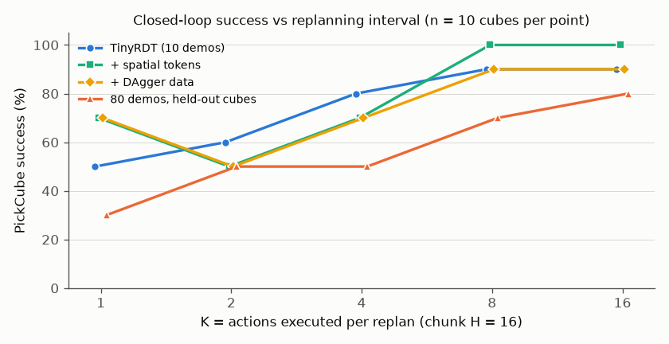
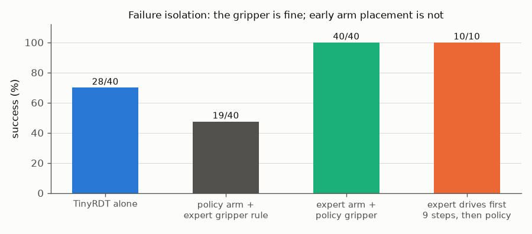
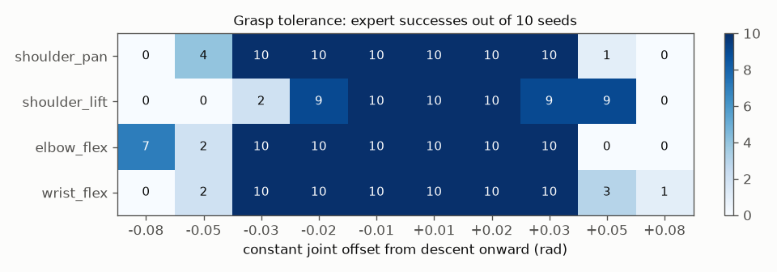
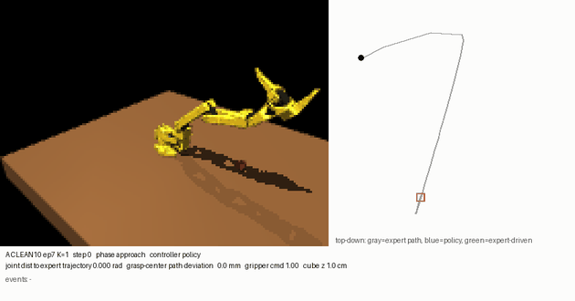

<div align="center">

# MiniRDT-SO101

**A small vision-conditioned Diffusion Transformer policy for the SO-101 robot arm, and a careful study of why accurate offline
action prediction does not automatically transfer to closed-loop manipulation.**


<em>TinyRDT (2.0M trainable parameters) controlling the simulated SO-101 closed loop from a 160×120 camera image and joint state.</em>

</div>

> [!WARNING]
> **Research preview: manipulation benchmarks are being revalidated.** A collision audit
> ([`TABLE_COLLISION_AUDIT.md`](TABLE_COLLISION_AUDIT.md)) found that the original simulator had no robot-table collision, and that its
> grasps went through the table. All manipulation success rates and rollout media below come from that invalid **physics-v1**
> environment. A physically valid **physics-v2** environment (side grasp, table collision) is in progress.

---

## Overview

MiniRDT-SO101 is a scaled-down, RDT-inspired robot foundation-model pipeline, built stage by stage and validated at each step
before scaling:

<p align="center"></p>

- **Simulation:** SO-101 (official CAD-derived MJCF) in MuJoCo; a PickCube task with randomised cube positions; a deterministic
  state-machine expert; a transparent, LeRobot-convertible episode format.
- **Policy:** TinyRDT, a 4-layer Transformer (d=192, 6 heads) over visual, proprioceptive and diffusion-time tokens plus 16 noisy
  action tokens. It predicts a 16-step (0.8 s) chunk of absolute joint targets.
- **Diffusion:** cosine noise schedule, x0-prediction, hold-last-action padding, EMA weights, deterministic DDIM (10 steps).
- **Control:** receding horizon: observe, predict 16 actions, execute K of them, re-observe.
- **Evaluation:** deterministic closed-loop benchmarks with expert-replay controls, a perturbation recovery benchmark, oracle
  ablations, and physical grasp-tolerance measurements.

<p align="center"></p>

## Highlights

| | |
|---|---|
| **Diffusion fix** | Found and fixed a terminal-SNR / ε-parameterisation failure. Sampled error on 10 memorised demos dropped **15×** (MAE 0.102 → 0.0067 rad); DDIM-5…100 and DDPM now agree (0.0045 vs 0.0046 rad). |
| **Reconstructed expert** | Discovered that the dataset was produced by an earlier expert version, and reconstructed it **bit-exactly** (`simulation/legacy_expert.py`). This enables exact counterfactual expert labels from any simulator state. |
| **Failure isolation** | Closed-loop failures are **early arm placement**, not the gripper or the sampler: the policy's gripper paired with the expert's arm succeeds 40/40, and 5–9 correct steps at the start make the unchanged policy succeed on every cube. |
| **Negative results, reported** | Corrective data (DAgger / perturbations), spatial visual tokens, state dropout, image-only input, 80-demo density and varied start poses were each tested with pre-registered protocols. None makes the 2M policy fully reliable. |
| **Practical lever** | Executing longer action chunks (K ≥ 8) is best in every model: ~91% on memorised cubes and 75% on held-out cubes (vs ~50% at K=1). |

## Results

<table>
<tr>
<td width="50%"></td>
<td width="50%"></td>
</tr>
<tr>
<td></td>
<td></td>
</tr>
</table>

Closed-loop PickCube on the 10 memorised cubes, all models ≈2.0M trainable parameters (successes out of 10 per K):

| model | K=1 | K=2 | K=4 | K=8 | K=16 | recovery (80) |
|---|---|---|---|---|---|---|
| TinyRDT, 10 demos | 5 | 6 | 8 | 9 | 9 | 63 |
| + DAgger corrective data | 7 | 5 | 7 | 9 | 9 | 51 |
| + spatial visual tokens | 7 | 5 | 7 | **10** | **10** | 61 |
| trained on 80 demos, **held-out** cubes | 3 | 5 | 5 | 7 | 8 | – |

<details>
<summary><b>Why does it fail?</b> An annotated failure: the policy follows a path offset toward a neighbouring cube.</summary>
<p align="center"></p>

All demonstrations start from the same home pose, so the 10 memorised trajectories overlap for about 6 steps (within 0.008 rad),
while the policy's tracking error there is 0.01–0.05 rad. Small early errors therefore land the arm nearer a *neighbouring* scene's
path. Failing grasps are offset toward the nearest other cube (median cosine 0.92). The measured grasp envelope is only about 7 mm
laterally. Details: [`docs/reports/03_failure_isolation.md`](docs/reports/03_failure_isolation.md).
</details>

## Installation

```bash
git clone https://github.com/Greninja44/mini-rdt-so101.git && cd mini-rdt-so101
uv venv --python 3.12 && uv pip install --python .venv/bin/python -e '.[dev]'
PYTEST_DISABLE_PLUGIN_AUTOLOAD=1 .venv/bin/python -m pytest -q
```

Headless rendering uses `MUJOCO_GL=egl`, selected automatically. On machines without GPU EGL (e.g. WSL) rendering falls back to
software at about 0.75 s/frame, which dominates closed-loop evaluation time.

## Quick start

```bash
# 1. Watch the expert (GUI if a display is available)
.venv/bin/python -m simulation.demo --seed 3000 --gui

# 2. Collect and validate demonstrations (120x160 RGB, 20 Hz)
.venv/bin/python -m data.collect --output artifacts/pickcube_smoke100_rgb160 --episodes 100 --seed 3000 --width 160 --height 120 --workers 4
.venv/bin/python -m data.validate artifacts/pickcube_smoke100_rgb160

# 3. Train TinyRDT on the 10-demo subset (validated recipe: configs/tinyrdt_clean10.json)
.venv/bin/python -m training.audit_overfit --output artifacts/tinyrdt_clean10 --schedule cosine --prediction x0 --padding hold \
    --steps 20000 --seed 17 --batch-size 8 --learning-rate 0.001 --device cuda --eval-interval 2000 --ema-decay 0.999

# 4. Offline gate (sampler comparison, timestep errors, conditioning ablations)
.venv/bin/python -m evaluation.research_audit --checkpoint artifacts/tinyrdt_clean10/ema_last.pt --output artifacts/tinyrdt_clean10/diag --device cuda

# 5. Closed-loop evaluation in MuJoCo (receding horizon; GIF + trajectory plot per rollout)
.venv/bin/python -m evaluation.closed_loop --checkpoint artifacts/tinyrdt_clean10/ema_last.pt --k 8 --max-steps 150 --output artifacts/eval_k8
```

**Also available:**
- `evaluation.recovery`: perturbation-recovery benchmark.
- `evaluation.oracle_ablation`: arm / gripper oracle split.
- `evaluation.grasp_sensitivity`: physical grasp tolerance.
- `data.collect_corrective`: DAgger and perturbation data with counterfactual expert labels.
- `evaluation.annotate`: annotated rollout GIFs.
- `scripts/make_readme_assets.py`: regenerates every figure in this README.

## Repository layout

```
simulation/   MuJoCo scene, SO-101 env, IK controllers, experts (legacy_expert = dataset generator, bit-exact)
data/         episode format, collection/validation, windowed ML dataset, corrective & varied-start data
models/       TinyRDT (pooled/spatial vision tokens, state dropout, frozen/trainable encoder), BC baseline
training/     diffusion process (DDPM/DDIM, cosine/linear, x0/ε), controlled training runner, inference policies
evaluation/   closed-loop evaluator, recovery & oracle benchmarks, offline gate, analysis and plotting
configs/      task config and the validated TinyRDT recipe
scripts/      artifact manifest, README asset generation, experiments/ (resumable pipelines per phase)
docs/         reports/ (findings), research/ (pre-registered log, handoff audit), diffusion.md, assets/
tests/        diffusion oracle tests, env/dataset tests, bit-exact expert/counterfactual regression
```

Datasets, checkpoints and rollouts are not versioned (`artifacts/`, about 800 MB). `docs/artifact_manifest.json` lists each file's
size and sha256 for backup and verification.

## Documentation

| report | question |
|---|---|
| [`00_summary`](docs/reports/00_summary.md) | all variants in one table, and decisions pending |
| [`01_closed_loop_diagnostics`](docs/reports/01_closed_loop_diagnostics.md) | why offline accuracy did not transfer to closed loop |
| [`02_corrective_data`](docs/reports/02_corrective_data.md) | does DAgger / perturbation data make the same 2M model robust? (no) |
| [`03_failure_isolation`](docs/reports/03_failure_isolation.md) | oracle split, expert-prefix and mechanism |
| [`research_log`](docs/research/research_log.md) | every experiment pre-registered before its result, including corrections |
| [`diffusion.md`](docs/diffusion.md) | equations, schedule and parameterisation choices |

## Roadmap

- [x] SO-101 MuJoCo PickCube, expert, 100-demo dataset
- [x] TinyRDT with a correct diffusion formulation; 10-demo offline overfit gate passes
- [x] Closed-loop evaluation, recovery benchmark, failure isolation
- [ ] Stronger visual conditioning (fine-tuned encoder), in progress
- [ ] Reliable closed loop on memorised cubes, then an 80-demo held-out generalisation benchmark
- [ ] Controlled capacity scaling: 2M → 5M → 10M → 20M → 40M (fixed data, seeds, recipe)
- [ ] Rotations, sizes and shapes; multiple objects and tasks; language conditioning
- [ ] External SO-100/101 datasets, sim-to-real on a physical SO-101

## Acknowledgements

- Robot model: [TheRobotStudio/SO-ARM100](https://github.com/TheRobotStudio/SO-ARM100) (Apache-2.0; licence in `simulation/assets/`).
- Inspired by [RDT-1B: a Diffusion Foundation Model for Bimanual Manipulation](https://github.com/thu-ml/RoboticsDiffusionTransformer).
- Built on [MuJoCo](https://mujoco.org), [PyTorch](https://pytorch.org) and torchvision's MobileNetV3.
- Conventions follow [LeRobot](https://github.com/huggingface/lerobot).

```bibtex
@article{liu2024rdt,
  title   = {RDT-1B: a Diffusion Foundation Model for Bimanual Manipulation},
  author  = {Liu, Songming and Wu, Lingxuan and Li, Bangguo and Tan, Hengkai and Chen, Huayu and Wang, Zhengyi and Xu, Ke and Su, Hang and Zhu, Jun},
  journal = {arXiv preprint arXiv:2410.07864},
  year    = {2024}
}
```

<details>
<summary><b>Simulator details (Phase 1)</b>: SO-101 conventions, API, expert, success criterion, dataset format</summary>

### SO-101 source and conventions
The model is vendored from [TheRobotStudio/SO-ARM100](https://github.com/TheRobotStudio/SO-ARM100/tree/main/Simulation/SO101), commit
`eecbe3e0a9ebb23e25ad7b2759b03884c6660903`. It is the CAD-derived **new calibration** MJCF with the original STL assets. Joint order:

| index | joint | MJCF radian range |
|---:|---|---:|
| 0 | shoulder_pan | [-1.919862, 1.919862] |
| 1 | shoulder_lift | [-1.745329, 1.745329] |
| 2 | elbow_flex | [-1.690000, 1.690000] |
| 3 | wrist_flex | [-1.658063, 1.658063] |
| 4 | wrist_roll | [-2.743847, 2.841206] |
| 5 | gripper hinge | [-0.174533, 1.745329] |

Names and ordering match LeRobot. The gripper is a normalised opening in [0, 1] (0 closed), converted to the MJCF hinge range.
Coordinates are MuJoCo world frame in metres, +Z up, with the table top at Z=0.

### API
```python
from simulation.env import SO101PickCubeEnv
env = SO101PickCubeEnv()
obs, info = env.reset(seed=123)          # obs: rgb uint8[120,160,3], joint_pos float32[5], gripper float32[1]
obs, reward, terminated, truncated, info = env.step(action)   # action: float32[6] absolute joint targets + opening
```

### Expert and success
The expert is a state machine: `HOME → MOVE_ABOVE_OBJECT → DESCEND → CLOSE_GRIPPER → LIFT → HOLD → SUCCESS`. It uses bounded
damped-least-squares position IK.

Success requires all of:
- a two-pad physical pinch;
- the cube lifted above 0.10 m;
- both held for 5 control steps.

Two convex fingertip pads, placed from the CAD fingertip transforms, provide contact. They never weld or teleport the cube.

The 100-episode dataset was generated by an earlier expert version: state-feedback IK in every phase, approach target 0.10 m, joint
margin 0.01. It is reconstructed bit-exactly in `simulation/legacy_expert.py`.

### Dataset format
Each `episodes/episode_XXXXXX/` holds equal-length `.npy` arrays (`rgb`, `joint_pos`, `gripper`, `action`, `cube_pose`,
`end_effector_pose`, `timestamp`, `expert_state`, `success`) and an `episode.json` with task, seed, rates, camera, action definition
and joint limits. `observation_t → action_t` alignment is explicit. `python -m data.validate DATASET` checks integrity.
</details>
