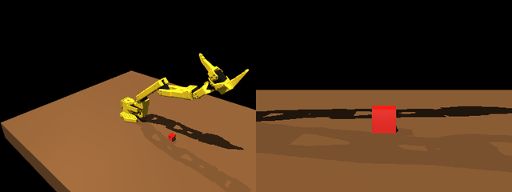
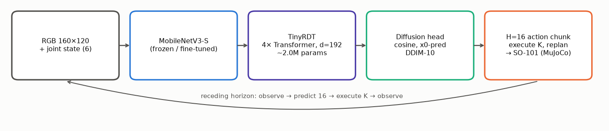
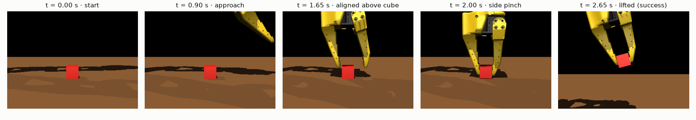
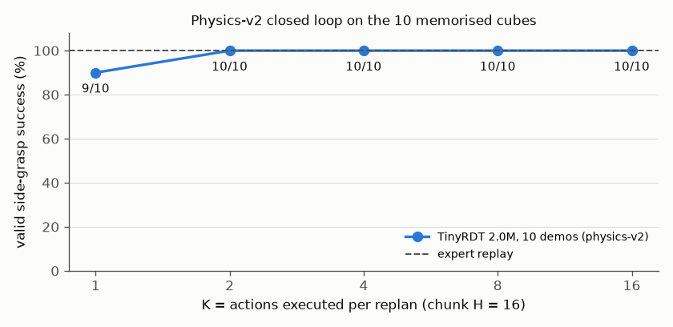
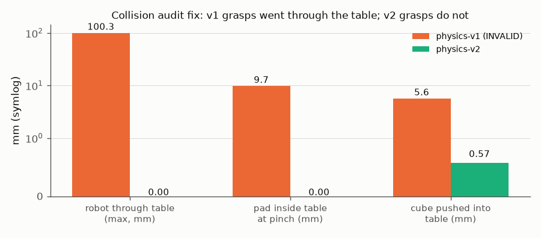
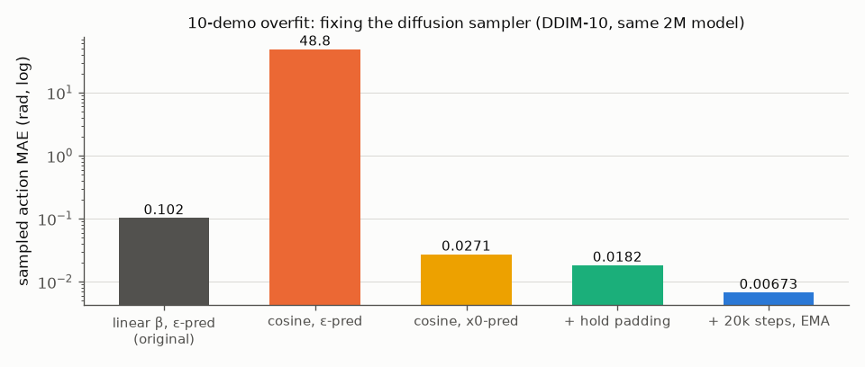

<div align="center">

# MiniRDT-SO101

**A small vision-conditioned Diffusion Transformer policy for the SO-101 robot arm, trained and evaluated on a physically validated
MuJoCo pick task, built and audited one stage at a time.**




<em>TinyRDT (2.0M trainable parameters) picking the cube with a genuine side pinch, closed loop from a 160×120 camera image and joint state.
Left: task camera. Right: side view at table height. The fingers never enter the table.</em>

</div>

> [!NOTE]
> **Benchmark version change.** A collision audit ([`TABLE_COLLISION_AUDIT.md`](TABLE_COLLISION_AUDIT.md)) found that the original
> simulator (**physics-v1**) had no robot–table collision, and that every "successful" grasp was a sandwich grasp with one jaw inside the
> table. All v1 manipulation results are **invalid** and kept only as history (tag `physics-v1-invalid`). Results below use
> **physics-v2**: table collision, calibrated contacts, a validated side-pinch expert and a stricter success criterion
> ([`PHYSICS_V2_REPORT.md`](PHYSICS_V2_REPORT.md)).

---

## Overview

MiniRDT-SO101 is a scaled-down, RDT-inspired robot-policy pipeline, built stage by stage and validated at each step before scaling:

<p align="center"></p>

- **Simulation (physics-v2):**
  - SO-101 (official CAD-derived MJCF) in MuJoCo, with robot and fingertip collision against the table.
  - Contacts calibrated so that the table and the grasped cube resist the arm's actuator forces.
  - PickCube with randomised cube positions.
- **Expert:** a state-feedback, top-down **side-pinch** expert: 6-D pose IK, a table-clearance-checked grasp height, and a slow
  re-centring final descent. Validated **100/100** on random cubes with zero table penetration.
- **Policy:** TinyRDT, a 4-layer Transformer (d=192, 6 heads) over visual, proprioceptive and diffusion-time tokens plus 16 noisy
  action tokens. It predicts a 16-step (0.8 s) chunk of absolute joint targets.
- **Diffusion:** cosine noise schedule, x0-prediction, hold-last-action padding, EMA weights, deterministic DDIM (10 steps).
- **Control:** receding horizon: observe, predict 16 actions, execute K of them, re-observe.
- **Success (v2)** requires all of:
  - a valid opposing side pinch (contact normals within 30° of horizontal, no top/underside contact) in each of 5 hold steps;
  - the cube lifted above 10 cm;
  - no invalid robot/cube/pad penetration at any point.

<p align="center"></p>

## Highlights

| | |
|---|---|
| **Physical validity first** | Found that the v1 simulator let the gripper pass ~100 mm through the table, and that every v1 success depended on it. Rebuilt the benchmark as a versioned physics-v2 with pre-registered tolerances and adversarial regression tests. |
| **Genuine side grasp, learned** | The same 2.0M TinyRDT trained on 10 physics-v2 demos succeeds **49/50** closed loop on the memorised cubes (**10/10 at every K ≥ 2**). Every success is a valid side pinch with **0.00 mm** robot–table penetration. |
| **Diffusion fix** | Found and fixed a terminal-SNR / ε-parameterisation failure: sampled error dropped **15×**; DDIM-5…100 and DDPM agree. |
| **Model bugs found** | A fingertip collision pad sat ~10 mm inside the jaw, and mass-normalised soft contacts let the gripper squeeze ~9 mm into the 10 g cube. Both were measured, fixed and regression-tested. |
| **Honest history** | Every experiment was pre-registered in [`docs/research/research_log.md`](docs/research/research_log.md), including the invalidated v1 results and the corrections. |

## Results (physics-v2)

<table>
<tr>
<td width="50%"></td>
<td width="50%"></td>
</tr>
<tr>
<td colspan="2" align="center"></td>
</tr>
</table>

| | result |
|---|---|
| expert validation | 10/10 on the CLEAN10 cubes; **100/100** on random cubes. Robot–table 0.00 mm, cube–table ≤ 0.25 mm, pad–cube ≤ 0.96 mm |
| dataset v2 | 100/100 successful episodes (5,408 frames), per-step contact diagnostics, validator: 0 errors |
| TinyRDT offline (10 demos) | all-window MAE 0.0050, worst joint 0.010 rad, episode start 0.0051; pre-registered gate **passes** |
| TinyRDT closed loop (10 memorised cubes) | K=1 9/10 · K=2 10/10 · K=4 10/10 · K=8 10/10 · K=16 10/10 (**49/50**); expert replay 10/10 |

**Not yet tested under physics-v2:** held-out cube positions (generalisation) and model scaling. The previous (v1) ablations are
archived in `docs/reports/` and `docs/assets/physics_v1_invalid/`, clearly marked invalid.

## Installation

```bash
git clone https://github.com/Greninja44/mini-rdt-so101.git && cd mini-rdt-so101
uv venv --python 3.12 && uv pip install --python .venv/bin/python -e '.[dev]'
PYTEST_DISABLE_PLUGIN_AUTOLOAD=1 .venv/bin/python -m pytest -q
```

Headless rendering uses `MUJOCO_GL=egl`, selected automatically. On machines without GPU EGL (e.g. WSL) rendering falls back to
software at about 0.75 s/frame, which dominates closed-loop evaluation time.

## Quick start (physics-v2)

```bash
# 1. Validate the side-pinch expert (10 fixed + 100 random cubes; task + side-camera frames)
.venv/bin/python -m evaluation.validate_expert_v2

# 2. Collect and validate the physics-v2 dataset (160x120 RGB, 20 Hz, per-step contact diagnostics)
.venv/bin/python -m data.collect_v2 --start 0 --count 100
.venv/bin/python -m data.validate_v2 artifacts/pickcube_physics_v2_rgb160

# 3. Train TinyRDT on the 10-demo subset (validated recipe: configs/tinyrdt_clean10.json)
.venv/bin/python -m training.audit_overfit --dataset artifacts/pickcube_physics_v2_rgb160 --output artifacts/physics_v2/tinyrdt_clean10 \
    --schedule cosine --prediction x0 --padding hold --steps 20000 --seed 17 --batch-size 8 --learning-rate 0.001 --device cuda \
    --eval-interval 2000 --ema-decay 0.999

# 4. Offline gate (sampler comparison, timestep errors, conditioning ablations)
.venv/bin/python -m evaluation.research_audit --checkpoint artifacts/physics_v2/tinyrdt_clean10/ema_last.pt \
    --dataset artifacts/pickcube_physics_v2_rgb160 --output artifacts/physics_v2/tinyrdt_clean10/diag --device cuda

# 5. Closed-loop evaluation (receding horizon; GIF + plot + v2 validity fields per rollout), then summarise
.venv/bin/python -m evaluation.closed_loop --checkpoint artifacts/physics_v2/tinyrdt_clean10/ema_last.pt \
    --dataset artifacts/pickcube_physics_v2_rgb160 --k 8 --max-steps 150 --output artifacts/physics_v2/closed_loop
.venv/bin/python -m evaluation.v2_closed_loop_summary --rollouts artifacts/physics_v2/closed_loop
```

Steps 3–5 are automated and resumable in `scripts/experiments/run_physics_v2.sh`. `PickCubeConfig(physics="v1")` reproduces the
invalid historical benchmark bit-exactly.

**Also available:**
- `evaluation.recovery`: perturbation-recovery benchmark.
- `evaluation.oracle_ablation`: arm / gripper oracle split.
- `evaluation.table_collision_audit`: numeric robot/pad/cube penetration audit of recorded rollouts.
- `evaluation.squeeze_test`: grasp-contact stiffness calibration.
- `data.collect_corrective`: DAgger and perturbation data with counterfactual expert labels.
- `evaluation.annotate`: annotated rollout GIFs.
- `scripts/make_readme_assets.py`: regenerates every figure in this README.

## Repository layout

```
simulation/   MuJoCo scene, SO-101 env, IK controllers, experts (legacy_expert = dataset generator, bit-exact)
data/         episode format, collection/validation, windowed ML dataset, corrective & varied-start data
models/       TinyRDT (pooled/spatial vision tokens, state dropout, frozen/trainable encoder), BC baseline
training/     diffusion process (DDPM/DDIM, cosine/linear, x0/ε), controlled training runner, inference policies
evaluation/   closed-loop evaluator, recovery & oracle benchmarks, offline gate, analysis and plotting
configs/      task config and the validated TinyRDT recipe
scripts/      artifact manifest, README asset generation, experiments/ (resumable pipelines per phase)
docs/         reports/ (findings), research/ (pre-registered log, handoff audit), diffusion.md, assets/
tests/        diffusion oracle tests, env/dataset tests, bit-exact expert/counterfactual regression
```

Datasets, checkpoints and rollouts are not versioned (`artifacts/`, about 800 MB). `docs/artifact_manifest.json` lists each file's
size and sha256 for backup and verification.

## Documentation

| report | question |
|---|---|
| [`PHYSICS_V2_REPORT`](PHYSICS_V2_REPORT.md) | **physics-v2: can MiniRDT learn a genuinely physical side grasp? (yes, on memorised scenes)** |
| [`TABLE_COLLISION_AUDIT`](TABLE_COLLISION_AUDIT.md) | the audit that invalidated physics-v1 |
| [`physics_v2_spec`](docs/research/physics_v2_spec.md) | pre-registered validity spec, tolerances and amendments |
| [`00_summary`](docs/reports/00_summary.md) | *(physics-v1, invalid)* all v1 variants in one table |
| [`01_closed_loop_diagnostics`](docs/reports/01_closed_loop_diagnostics.md) | *(physics-v1, invalid)* why offline accuracy did not transfer to closed loop |
| [`02_corrective_data`](docs/reports/02_corrective_data.md) | *(physics-v1, invalid)* does DAgger / perturbation data make the same 2M model robust? (no) |
| [`03_failure_isolation`](docs/reports/03_failure_isolation.md) | *(physics-v1, invalid)* oracle split, expert-prefix and mechanism |
| [`research_log`](docs/research/research_log.md) | every experiment pre-registered before its result, including corrections |
| [`diffusion.md`](docs/diffusion.md) | equations, schedule and parameterisation choices |

## Roadmap

- [x] SO-101 MuJoCo PickCube, expert, dataset
- [x] TinyRDT with a correct diffusion formulation; 10-demo offline overfit gate passes
- [x] Collision audit; physics-v2 benchmark (table collision, calibrated contacts, validated side-pinch expert, stricter success)
- [x] Reliable closed loop on memorised cubes under physics-v2 (49/50)
- [ ] Physics-v2 generalisation: 80 training demos → held-out cube positions, fixed K
- [ ] Controlled capacity scaling: 2M → 5M → 10M → 20M → 40M (fixed data, seeds, recipe)
- [ ] Rotations, sizes and shapes; multiple objects and tasks; language conditioning
- [ ] External SO-100/101 datasets, sim-to-real on a physical SO-101

## Acknowledgements

- Robot model: [TheRobotStudio/SO-ARM100](https://github.com/TheRobotStudio/SO-ARM100) (Apache-2.0; licence in `simulation/assets/`).
- Inspired by [RDT-1B: a Diffusion Foundation Model for Bimanual Manipulation](https://github.com/thu-ml/RoboticsDiffusionTransformer).
- Built on [MuJoCo](https://mujoco.org), [PyTorch](https://pytorch.org) and torchvision's MobileNetV3.
- Conventions follow [LeRobot](https://github.com/huggingface/lerobot).

```bibtex
@article{liu2024rdt,
  title   = {RDT-1B: a Diffusion Foundation Model for Bimanual Manipulation},
  author  = {Liu, Songming and Wu, Lingxuan and Li, Bangguo and Tan, Hengkai and Chen, Huayu and Wang, Zhengyi and Xu, Ke and Su, Hang and Zhu, Jun},
  journal = {arXiv preprint arXiv:2410.07864},
  year    = {2024}
}
```

<details>
<summary><b>Simulator details (Phase 1)</b>: SO-101 conventions, API, expert, success criterion, dataset format</summary>

### SO-101 source and conventions
The model is vendored from [TheRobotStudio/SO-ARM100](https://github.com/TheRobotStudio/SO-ARM100/tree/main/Simulation/SO101), commit
`eecbe3e0a9ebb23e25ad7b2759b03884c6660903`. It is the CAD-derived **new calibration** MJCF with the original STL assets. Joint order:

| index | joint | MJCF radian range |
|---:|---|---:|
| 0 | shoulder_pan | [-1.919862, 1.919862] |
| 1 | shoulder_lift | [-1.745329, 1.745329] |
| 2 | elbow_flex | [-1.690000, 1.690000] |
| 3 | wrist_flex | [-1.658063, 1.658063] |
| 4 | wrist_roll | [-2.743847, 2.841206] |
| 5 | gripper hinge | [-0.174533, 1.745329] |

Names and ordering match LeRobot. The gripper is a normalised opening in [0, 1] (0 closed), converted to the MJCF hinge range.
Coordinates are MuJoCo world frame in metres, +Z up, with the table top at Z=0.

### API
```python
from simulation.env import SO101PickCubeEnv
env = SO101PickCubeEnv()
obs, info = env.reset(seed=123)          # obs: rgb uint8[120,160,3], joint_pos float32[5], gripper float32[1]
obs, reward, terminated, truncated, info = env.step(action)   # action: float32[6] absolute joint targets + opening
```

### Expert and success
The expert is a state machine: `HOME → MOVE_ABOVE_OBJECT → DESCEND → CLOSE_GRIPPER → LIFT → HOLD → SUCCESS`. It uses bounded
damped-least-squares position IK.

Success requires all of:
- a two-pad physical pinch;
- the cube lifted above 0.10 m;
- both held for 5 control steps.

Two convex fingertip pads, placed from the CAD fingertip transforms, provide contact. They never weld or teleport the cube.

The 100-episode dataset was generated by an earlier expert version: state-feedback IK in every phase, approach target 0.10 m, joint
margin 0.01. It is reconstructed bit-exactly in `simulation/legacy_expert.py`.

### Dataset format
Each `episodes/episode_XXXXXX/` holds equal-length `.npy` arrays (`rgb`, `joint_pos`, `gripper`, `action`, `cube_pose`,
`end_effector_pose`, `timestamp`, `expert_state`, `success`) and an `episode.json` with task, seed, rates, camera, action definition
and joint limits. `observation_t → action_t` alignment is explicit. `python -m data.validate DATASET` checks integrity.
</details>
