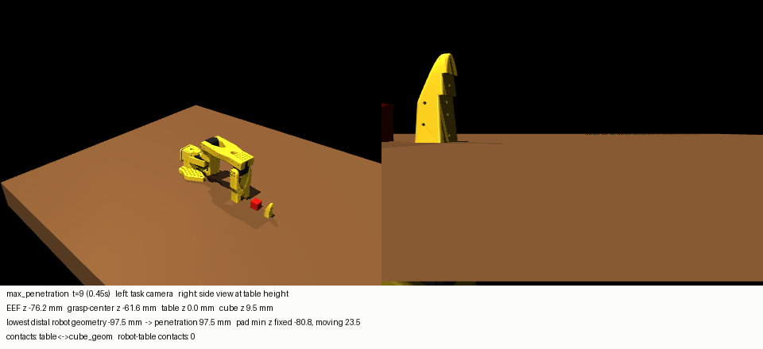
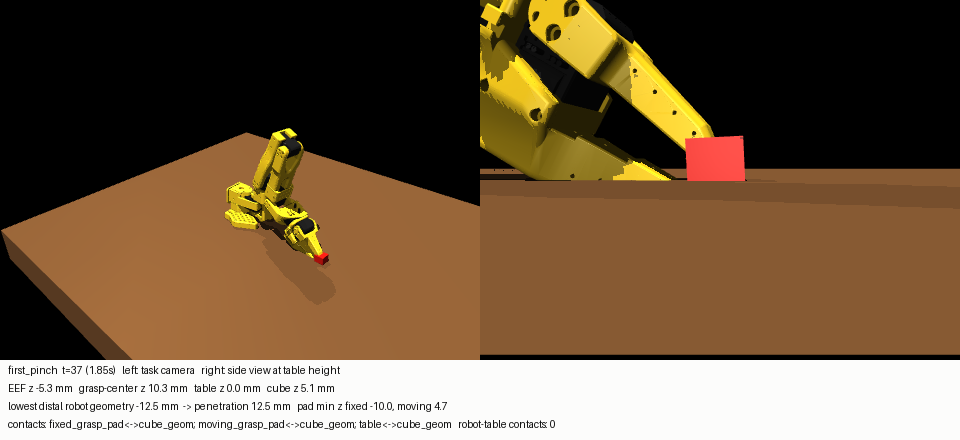

# Table-collision audit: is the SO-101 penetrating the table, and do successes depend on it?

**Verdict: yes, and yes.** The robot has no collision with the table at all (collision filtering), so it passes up to ~100 mm through
the table. More importantly, **every successful grasp in this project** (10/10 expert demonstrations, 28/28 TinyRDT successes, and
10/10 grasps by the current `expert.py`) is a *top-bottom sandwich* in which one fingertip pad sits ~9–10 mm **inside** the table,
under the cube. It is not a side pinch on a cube resting on a solid table. The success criterion (two-pad contact + lift + hold)
accepts this.

**Previously reported success rates are therefore not physically valid PickCube success rates and require re-validation.** This
covers the expert benchmark, CLEAN10, TinyRDT closed-loop and every Phase 5–10 comparison. Nothing was changed: no physics,
geometry, expert, success criterion, dataset or policy.

Measurements come from simulator state, never from pixels. Script: `evaluation/table_collision_audit.py`. Raw data:
`docs/audit/table_collision/audit.json`. Frames: `docs/audit/table_collision/*.png`.

## 1. Source of `docs/assets/rollout_success.gif`
- The source is `scripts/make_readme_assets.py::rollout_media`, which re-renders rollout
  `artifacts/closed_loop_v2/tinyrdt_ema/ep006_k8.npz` by replaying its recorded executed actions.
- **Policy:** TinyRDT EMA checkpoint `artifacts/research_audit/cosine_x0_hold_ema/ema_last.pt`, 2,009,670 trainable parameters.
- **Setting:** memorised CLEAN10 cube, env seed 3006, K=8, DDIM-10.
- **Replay fidelity:** joint error vs the recorded rollout is 0.0 rad, and it reaches the same success at t=51. The GIF is a faithful
  render of that rollout.

## 2. Collision geometry configuration (effective model after `SO101PickCubeEnv.__init__`)
MuJoCo creates a contact between two geoms only if `(contype_a & conaffinity_b) || (contype_b & conaffinity_a)`.

| geom(s) | body | contype / conaffinity | collides with |
|---|---|---|---|
| `table` (box, top at z = 0.000 m) | world | 1 / 1 | cube only |
| `cube_geom` (box, 20 mm) | cube | 1 / 3 | table; pads while enabled |
| `fixed_grasp_pad`, `moving_grasp_pad` (convex boxes) | gripper, moving jaw | 0 / 0, or **2 / 2 only while the gripper is commanded closed** | cube only (2 & 1 = 0 with the table) |
| 30 robot meshes: base, shoulder, upper_arm, lower_arm, wrist, gripper, moving jaw (visual group 2 and collision group 3) | robot | **0 / 0** | nothing |

- `env.py` deliberately zeroes contype/conaffinity for every geom except table, cube and pads (comment: "Disable high-resolution STL
  contacts… non-convex contact artefacts").
- Every visual mesh has a collision-group mesh counterpart in the vendor MJCF, but **all of them are disabled**. The only robot
  collision geometry is the two fingertip pads, and they cannot touch the table.

## 3. Maximum measured penetration
Penetration = table top z − the lowest vertex/corner of the gripper, moving-jaw and pad geometry. Robot–table *contacts*: 0 in every
rollout, as the filtering predicts.

| rollout(s) | max penetration | when | deepest part | max pad penetration |
|---|---|---|---|---|
| README rollout (ep6, K=8) | **97.5 mm** | t=9 (approach); 26 steps below the table | gripper body | 80.8 mm |
| 10 CLEAN10 expert demos | 69–96 mm | from t=6 (approach), 23–27 steps | gripper body | 46–79 mm |
| 40 TinyRDT rollouts | 63–100 mm | approach | gripper body | — |
| current `expert.py` (10 seeds) | 12–19 mm | grasp only, from t=35 | gripper / pads | ≈9.5–9.7 mm |

The approach penetration comes from the dataset-generating expert (DLS IK from the home pose to an overhead target). The comment in
`ExpertConfig` warns about exactly this ("can swing the wrist below the table"). The current `expert.py` avoids it with a joint
interpolation, but still penetrates during the grasp.

## 4. Contact pairs
- Contacts that ever occur: `table↔cube_geom`, `fixed_grasp_pad↔cube_geom` and `moving_grasp_pad↔cube_geom`. There is never a robot↔table contact.
- **Cube↔table:** at rest the cube center is at 9.5 mm (0.5 mm soft-contact sink). Under the closing jaw it is pushed **3.3–6.0 mm into
  the table** in every successful grasp. This is soft-contact compliance under pad force, not a hard constraint.
- **Pad↔cube contact normals** during the pinch, while the cube is still below 3 cm: median |n_z| = 0.78–0.99, and **100% of contacts
  are vertical** (|n_z| > 0.7) in every success. A side pinch would have |n_z| ≈ 0.

## 5. Is the visual penetration real?
**Yes.** It is real geometric overlap of robot geometry with the table volume, caused by collision filtering (category 4: collision
geometry disabled). Walking through the other categories:
- **Not solver softness (2):** robot–table contacts don't exist at all, and the depths are 10–100 mm.
- **Not camera perspective (3):** it is measured from vertex coordinates, and the side-view frames confirm it.
- **Invalid commanded poses (6):** yes. The data-generating expert commands approach poses ~70–96 mm inside the table, and both
  experts command a grasp pose with one pad ~10 mm inside.
- **Policy exploitation (7):** the learned policy imitates both. It does not invent the exploit (see §7).

## 6. Expert penetration statistics (CLEAN10, recorded actions replayed; replay error 0.0)

| ep | max pen (mm) | pad in table at first pinch (mm) | cube pushed into table (mm) | pad below cube bottom (mm) | vertical pad-cube normals |
|---|---|---|---|---|---|
| 0 | 85.4 | 9.7 | 5.2 | 5.7 | 100% |
| 2 | 94.1 | 9.7 | 3.5 | 6.7 | 100% |
| 3 | 91.7 | 9.7 | 5.6 | 6.7 | 100% |
| 4 | 68.6 | 9.5 | 5.2 | 5.6 | 100% |
| 5 | 88.5 | 9.7 | 5.6 | 6.9 | 100% |
| 6 | 96.0 | 9.6 | 5.3 | 5.6 | 100% |
| 7 | 81.7 | 9.7 | 5.5 | 7.2 | 100% |
| 8 | 70.5 | 9.7 | 5.3 | 7.3 | 100% |
| 9 | 75.5 | 9.6 | 5.1 | 5.4 | 100% |
| 11 | 76.1 | 9.7 | 3.8 | 6.3 | 100% |

The penetration is **expert behaviour**, present in 100% of the demonstrations the policy was trained on.

## 7. TinyRDT penetration statistics (all 40 clean-model rollouts; replay error 0.0; replayed success equals recorded success in 40/40)
- Max penetration 63–100 mm in every rollout, during approach, as in the demos.
- **All 28 successes:** pad 8.2–10.4 mm inside the table at the first pinch, cube pushed 3.3–6.0 mm into it, 100% vertical pad-cube
  normals. This is the expert's sandwich grasp, reproduced.
- 12 failures: 11 never pinched. The one failure that pinched (ep0, K=4) is the only rollout with mostly *side* normals
  (|n_z| median 0.12), and it did not lift.
- **Penetration is not learned-policy-only behaviour.** The policy faithfully imitates an expert whose trajectories and grasp are
  themselves physically invalid.

## 8. Does any reported success depend on penetration?
**Yes: all of them.** The success rule (`closed ∧ grasp-center within 45 mm ∧ both pads in contact`, then lift above 0.10 m held for
5 steps) is satisfied in the README rollout (t=37 pinch, t=43 lift, success t=51). The pinch, however, is:
- one pad ~10 mm below the table surface and ~5 mm below the cube's bottom face;
- the other pad pressing the cube's top face, pushing the cube ~5 mm into the table;
- all contacts vertical.

The cube is then carried like a sandwich (pads 2–7 mm below the cube bottom while lifting, |n_z| 0.92–1.0).
- With a solid table, the lower jaw could not reach that position, and this grasp would not exist.
- The success criterion does not check contact geometry, and robot–table contact cannot occur, so the criterion cannot reject it.
- **`rollout_success.gif` does satisfy the documented pinch + lift + hold conditions, but those conditions are met through physically
  invalid geometry. It should not be presented as a physically valid grasp.**

## 9. Frames (task camera left; side view at table height right; numbers from simulator state)
- `readme_rollout_first_penetration_t006.png`: the gripper starts entering the table during approach.
- `readme_rollout_max_penetration_t009.png`: **97.5 mm**. Only a jaw tip remains above the table; the fixed pad is at −80.8 mm.
- `readme_rollout_gripper_close_command_t030.png`: the close command, with the fixed pad at −16.8 mm.
- `readme_rollout_first_pad_cube_contact_t031.png`: first pad↔cube contact (vertical normal, |n_z| 0.87).
- `readme_rollout_first_pinch_t037.png`: the pinch registers; fixed pad at −10.0 mm, cube center at 5.1 mm (pushed in).
- `readme_rollout_first_cube_lift_3mm_t043.png` and `readme_rollout_success_t051.png`: lift and success.

## 10. Recommended fix (NOT applied, per instructions)
The problem is real and substantial. The recommended order is below; each step needs its own validation.
1. **Enable robot↔table collision.** Give the distal links (gripper, moving jaw, wrist, lower arm) convex collision geometry that
   collides with the table: the vendor collision-group meshes (MuJoCo uses their convex hulls), or simple boxes/capsules. Let the pads
   collide with the table too (add bit 1 to their conaffinity). Re-check the fingertip-contact stability concern that motivated the
   filtering.
2. **Fix the expert so it is valid under (1):**
   - an approach that keeps all geometry above the table, e.g. the current expert's high joint interpolation, verified;
   - a grasp pose and orientation that produce a **side pinch**: jaws closing horizontally about the cube, with pad bottoms above the
     table top. With 5 DOF, choose wrist_flex / wrist_roll targets explicitly instead of position-only IK.
   - Verify with this audit: 0 mm robot–table penetration beyond a small solver tolerance, and pad-cube normals |n_z| < 0.3.
3. **Tighten the success criterion:**
   - require side-face pad-cube contacts (|n_z| below a threshold);
   - require no robot–table penetration beyond a tolerance (e.g. 2 mm) during the grasp;
   - reject the cube being pushed more than ~1–2 mm into the table.
   - Consider stiffer cube–table contact parameters, since 5 mm sink under pad force is large.
4. **Regenerate the dataset** with the fixed expert and environment. Re-run the offline gate and the closed-loop benchmarks.
5. **Re-validate before reuse:**
   - All previous success rates (expert 100%, TinyRDT 28/40, and the Phase 5–10 comparisons) are within-simulator results under an
     invalid grasp model. They must not be reported as physical PickCube performance.
   - The methodological findings (diffusion fix, sampler analysis, K effect, failure-isolation technique, corrective-label machinery)
     remain valid as tools. Their numeric conclusions about grasp success should be re-measured after the fix.
   - The README GIF and "success" claims should be withdrawn or labelled until then.

Reproduce: `python -m evaluation.table_collision_audit --artifacts <path to artifacts>`.
